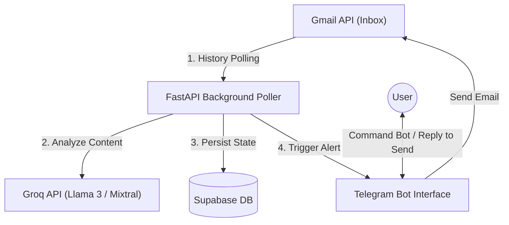

# ⚡ Gmail AI Agent (v2.0.0)

An intelligent, autonomous personal assistant that monitors your Gmail inbox in real-time, analyzes incoming messages using advanced AI models, alerts you of important items via Telegram, and lets you compose and send emails directly using natural language from Telegram.

---

## 🚀 System Architecture



---

## ✨ Core Features

*   **Real-Time Email Monitoring**: Uses high-performance, history-based polling instead of heavy webhooks, detecting only new emails in your inbox without rate-limiting issues.
*   **AI Importance & Urgency Classification**: Automatically scores emails (0-100), detects urgency levels (`LOW`, `MEDIUM`, `HIGH`, `CRITICAL`), and classifies them into categories (e.g., `Interview`, `Payment`, `Security`, `Academic`, `General`).
*   **Intelligent Summaries & Deadlines**: Generates concise 2-3 sentence summaries and automatically extracts deadline dates.
*   **Automatic Telegram Alerts**: Sends a beautifully formatted card on Telegram containing key insights, importance reason, and action items for all important emails.
*   **Natural Language Outbox**: Send emails by talking to your bot! Type `Send email to hr@company.com`, and the interactive assistant guides you through the subject, body, and confirmation flow.
*   **Contact Groups**: Configure target groups (e.g., `"Recruiters"`, `"Family"`) in Supabase to broadcast emails to multiple recipients at once.
*   **Robust Token Lifecycle**: Integrated with Google OAuth 2.0 with a custom timezone-aware auto-refresh mechanism preventing unauthorized access dropouts.

---

## 🛠️ Technology Stack

*   **Backend Framework**: [FastAPI](https://fastapi.tiangolo.com/) (Uvicorn server, asynchronous router)
*   **Database**: [Supabase](https://supabase.com/) (PostgreSQL backend via Python Client SDK)
*   **LLM Pipeline**: [Groq Cloud API](https://groq.com/)
*   **Notification Engine**: [python-telegram-bot](https://python-telegram-bot.org/) (Async framework)
*   **Auth**: [Google OAuth 2.0 Flow](https://developers.google.com/identity/protocols/oauth2)

---

## 📁 Directory Structure

```text
gmail-ai-agent/
├── app/
│   ├── ai/
│   │   └── analyzer.py       # Groq prompt templates and classification logic
│   ├── api/
│   │   └── routes.py         # FastAPI endpoints (OAuth callback, Health, Stats)
│   ├── database/
│   │   ├── client.py         # Supabase connection and CRUD statements
│   │   └── schema.sql        # Database schema script
│   ├── gmail/
│   │   ├── auth.py           # Google credentials manager and token refresher
│   │   └── client.py         # Gmail inbox querying and outbox sender
│   ├── services/
│   │   └── poller.py         # Background history polling thread coordinator
│   ├── telegram/
│   │   └── bot.py            # Telegram commands, message wizard, and alert formatter
│   ├── config.py             # Settings loader via pydantic-settings
│   └── logger.py             # Core rotating file logger configuration
├── main.py                   # Application entry point (FastAPI lifespan controller)
├── requirements.txt          # Python dependencies
├── Dockerfile                # Production container blueprint
├── Procfile                  # Platform-as-a-service execution directive
├── SETUP.md                  # Comprehensive setup credentials walkthrough
└── README.md                 # Project summary and documentation
```

---

## 🏁 Quick Setup

Detailed credentials setup guidelines for Google Cloud Console, Supabase, Groq, and Telegram can be found in the [SETUP.md](file:///c:/Users/sai/Desktop/gmail-ai-agents/gmail-ai-agent/SETUP.md) file.

### 1. Environment Variables Configuration
Create a `.env` file in the root directory:

```env
# Google OAuth 2.0
GOOGLE_CLIENT_ID=your_client_id
GOOGLE_CLIENT_SECRET=your_client_secret
GOOGLE_REDIRECT_URI=https://your-domain.up.railway.app/auth/callback

# Telegram Bot
TELEGRAM_BOT_TOKEN=your_bot_token
TELEGRAM_CHAT_ID=your_chat_id

# Groq LLM Key
GROQ_API_KEY=your_groq_api_key

# Supabase Configurations
SUPABASE_URL=https://your-project.supabase.co
SUPABASE_KEY=your_supabase_service_role_key

# App Environment Settings
APP_HOST=0.0.0.0
APP_PORT=8000
APP_BASE_URL=your-domain.up.railway.app
SECRET_KEY=any_secure_random_string
DEBUG=false
POLL_INTERVAL=30
```

### 2. Local Run
Install dependencies and run:
```bash
pip install -r requirements.txt
python main.py
```
Visit `http://localhost:8000/auth/login` to connect your Gmail account to the local agent.

---

## 🤖 Bot Interaction Commands

| Command | Action |
| :--- | :--- |
| `/start` | Starts the bot and checks active listener status |
| `/help` | Explains all commands and email sending examples |
| `/inbox` | Displays the last 10 classified "Important" emails |
| `/search <query>` | Performs a text search across subject lines, summaries, and senders |
| `/summarize` | Aggregates all important emails received in the last 24 hours |
| `/stats` | Shows data processing statistics (totals, alerts sent) |
| `/groups` | Lists registered email broadcast groups |

### ✉️ Example: Sending an Email

Simply type a message following this format into your private chat with the bot:
```text
Send email to hr@targetcompany.com
Subject: Interview Confirmation
Dear Team, I confirm my availability for the upcoming technical discussion on Monday at 11 AM.
```
The bot will verify the contents and prompt you to reply with `YES` to finalize sending.
