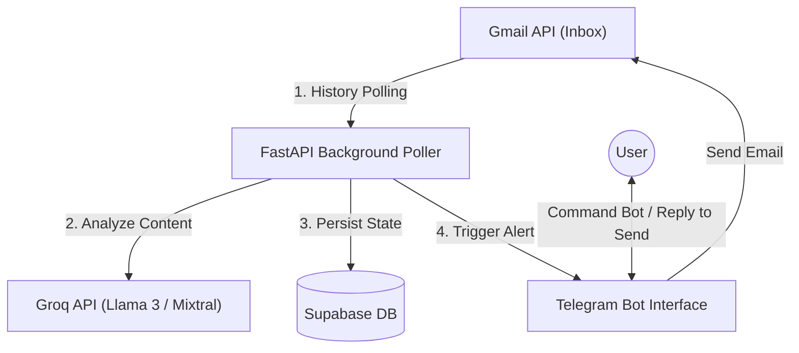

# 🤖 Gmail AI Agent v2.0.0

A fully autonomous, 24/7 personal AI secretary that monitors your Gmail inbox, intelligently analyzes every incoming email using AI, sends instant Telegram alerts for important emails, and lets you send emails directly from Telegram — completely free, no VPS required.

---

## 🌟 What It Does

> You never need to open Gmail again. The agent does everything automatically.

- 📬 **Monitors Gmail every 30 seconds** — detects new emails instantly
- 🧠 **AI analyzes every email** — scores importance, detects urgency and deadlines
- 🔔 **Automatic Telegram alerts** — notifies you immediately for important emails
- 🚫 **Ignores spam silently** — promotions, newsletters, ads are skipped
- 📤 **Send emails via Telegram** — just type naturally, no need to open Gmail
- 👥 **Contact group support** — send to multiple recipients at once
- 📊 **Full email history** — search, summarize, view stats anytime

---

## 🚀 System Architecture



---
## 🛠️ Tech Stack

| Layer | Technology |
|---|---|
| **Backend** | Python 3.14, FastAPI, Uvicorn |
| **AI Engine** | Groq API (GPT-OSS-120B) (free) |
| **Database** | Supabase (PostgreSQL) (free) |
| **Notifications** | Telegram Bot API |
| **Auth** | Google OAuth 2.0 |
| **Hosting** | Render.com (free tier) |
| **Keep-Alive** | UptimeRobot (free) |

---

## 💸 Cost

| Service | Cost |
|---|---|
| Render hosting | ✅ Free |
| UptimeRobot pinger | ✅ Free |
| Supabase database | ✅ Free |
| Groq AI analysis | ✅ Free |
| Telegram Bot API | ✅ Free |
| Gmail API | ✅ Free |
| **Total** | **$0/month forever** |

---

## 📁 Project Structure

```
gmail-ai-agent/
├── main.py                    # Entry point — FastAPI + Telegram + Polling
├── requirements.txt           # Python dependencies
├── render.yaml                # Render.com deployment config
├── Dockerfile                 # Docker container config
├── Procfile                   # PaaS start command
├── RENDER_SETUP.md            # Render + UptimeRobot deployment guide
├── SETUP.md                   # Full credentials setup guide
└── app/
    ├── config.py              # Environment settings (Pydantic)
    ├── logger.py              # Rotating file logger
    ├── ai/
    │   └── analyzer.py        # Groq AI email analysis
    ├── api/
    │   └── routes.py          # FastAPI routes (OAuth, health, ping, stats)
    ├── database/
    │   ├── client.py          # All Supabase DB operations
    │   └── schema.sql         # Database schema (run once in Supabase)
    ├── gmail/
    │   ├── auth.py            # Google OAuth 2.0 + token refresh
    │   └── client.py          # Gmail fetch, parse, send
    ├── services/
    │   └── poller.py          # Gmail polling loop (every 30s)
    └── telegram/
        └── bot.py             # Bot commands + auto alerts + email send flow
```

---

## 🚀 Deployment (Free — No VPS)

### Prerequisites
- Google Cloud account (free)
- Supabase account (free)
- Telegram account
- Groq account (free)
- Render account (free)
- UptimeRobot account (free)

### Quick Deploy Steps

**1. Supabase** — Run `app/database/schema.sql` in SQL Editor

**2. Google Cloud** — Enable Gmail API, create OAuth 2.0 credentials

**3. Telegram** — Create bot via @BotFather, get token and chat ID

**4. Groq** — Get API key from console.groq.com

**5. Render** — Deploy from GitHub, add environment variables

**6. UptimeRobot** — Add monitor for `/ping` endpoint (prevents sleeping)

**7. Authenticate** — Visit `https://your-app.onrender.com/auth/login`

> See [RENDER_SETUP.md](RENDER_SETUP.md) for the complete step-by-step guide.

---

## ⚙️ Environment Variables

```env
GOOGLE_CLIENT_ID=your_google_client_id
GOOGLE_CLIENT_SECRET=your_google_client_secret
GOOGLE_REDIRECT_URI=https://your-app.onrender.com/auth/callback
TELEGRAM_BOT_TOKEN=your_telegram_bot_token
TELEGRAM_CHAT_ID=your_telegram_chat_id
GROQ_API_KEY=your_groq_api_key
SUPABASE_URL=https://your-project.supabase.co
SUPABASE_KEY=your_supabase_service_role_key
APP_BASE_URL=https://your-app.onrender.com
SECRET_KEY=any_random_string
POLL_INTERVAL=30
```

---

## 🤖 Telegram Commands

| Command | What it does |
|---|---|
| `/start` | Activate the bot |
| `/help` | Show all commands |
| `/inbox` | Last 10 important emails |
| `/search <query>` | Search emails by keyword |
| `/summarize` | Last 24 hours summary |
| `/stats` | Processing statistics |
| `/groups` | List contact groups |

---

## 📤 Send Emails via Telegram

Just type naturally in one message:

**Single recipient:**
```
Send email to hr@company.com
Subject: Interview Confirmation
I confirm my availability for tomorrow at 10 AM.
```

**Multiple recipients:**
```
Send email to john@gmail.com, alice@gmail.com
Subject: Project Update
Please review the latest changes.
```

**Contact group:**
```
Send email to Recruiters
Subject: Application Follow-up
I wanted to follow up on my application.
```

> For more than 5 recipients, the bot asks for confirmation before sending.

---

## 🔔 Example Telegram Alert

```
🚨 IMPORTANT EMAIL
────────────────────────────
📂 Category: Interview
📨 From: HR Team <hr@company.com>
📝 Subject: Interview Invitation - Software Engineer

📋 Summary:
You have been shortlisted for the next interview round.
Please attend the technical interview tomorrow at 10 AM.

✅ Action Required
🎯 Score: 95/100
⚡ Urgency: HIGH
💡 Reason: Interview invitation requiring immediate action
⏰ Deadline: Tomorrow 10:00 AM
```

---

## 🧠 AI Classification

Every email is analyzed and scored:

| Score | Urgency | Examples |
|---|---|---|
| 80-100 | CRITICAL/HIGH | Interview invites, OTP, security alerts, job offers |
| 60-79 | HIGH/MEDIUM | Payment confirmations, bank alerts, deadlines |
| 40-59 | MEDIUM | Academic notices, client emails |
| 0-39 | LOW | Promotions, newsletters, spam (ignored) |

---

## 📡 API Endpoints

| Endpoint | Description |
|---|---|
| `GET /health` | Health check |
| `GET /ping` | UptimeRobot keep-alive |
| `GET /stats` | Processing statistics |
| `GET /auth/login` | Start Gmail OAuth |
| `GET /auth/callback` | OAuth callback |

---
## 🤖 Bot Interaction Commands

| Command | Action |
| :--- | :--- |
| `/start` | Starts the bot and checks active listener status |
| `/help` | Explains all commands and email sending examples |
| `/inbox` | Displays the last 10 classified "Important" emails |
| `/search <query>` | Performs a text search across subject lines, summaries, and senders |
| `/summarize` | Aggregates all important emails received in the last 24 hours |
| `/stats` | Shows data processing statistics (totals, alerts sent) |
| `/groups` | Lists registered email broadcast groups |

The bot will verify the contents and prompt you to reply with `YES` to finalize sending.
---

## 🔒 Security

- OAuth tokens stored securely in Supabase
- Auto token refresh before expiry
- Real API keys only in environment variables — never in code
- `.env` file blocked by `.gitignore`

---

## 📄 License

MIT License — free to use, modify, and distribute.
